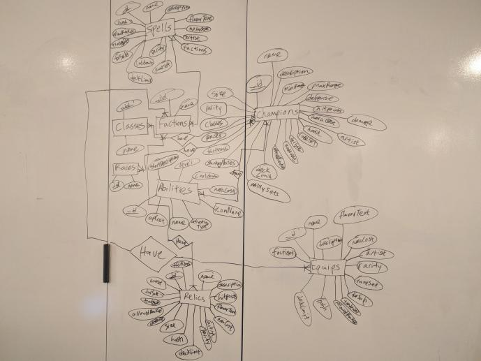
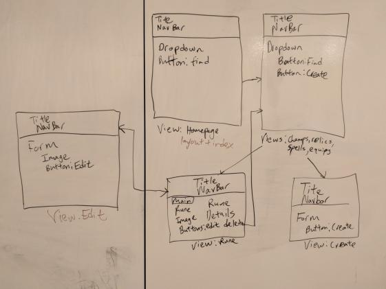
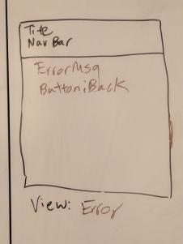

# Poxnora Search Engine
Fullstack MEHN search engine application to search/filter runes in Poxnora built as a MEHN(MongoDB, Express, Handlebars, Node) application. App also has a branch called *mehn-crud* that is a full CRUD app.

## Technologies and Frameworks Used
#### **Bootstrap**
#### **Heroku**
#### **JQuery**
#### **Handlebars(hbs)**
#### **ExpressJS**
#### **method-override**
#### **mLab**
#### **MongoDB**
#### **Mongo Shell**
#### **Mongoose**
#### **Javascript, HTML, CSS**

## Tools Used
#### Github Projects
#### MonggoDB Compass
<https://www.mongodb.com/products/compass>
#### ReText
<https://github.com/retext-project/retext>

## Prerequisites
### NodeJS
<https://nodejs.org/en/>

## To Test On Local Machine
1. Run `npm i` in node terminal to download all the dependencies
2. Navigate to the JSON directory in project
3. Run these commands to seed the mongo database:
```
mongoimport --db poxnora-database --collection champions --file champs.json --jsonArray
mongoimport --db poxnora-database --collection spells --file spells.json --jsonArray
mongoimport --db poxnora-database --collection relics --file relics.json --jsonArray
mongoimport --db poxnora-database --collection equips --file equips.json --jsonArray
```
4. Run `node server.js` or `npm start`
5. Navigate to <http://localhost:3000/> to test the code.

### To run the test the Full CRUB app on branch *mehn-crud*
Run `git checout mehn-crud` to switch to that branch and follow steps 4 and 5 from above

## Whiteboarding
### Entity Relationship Diagram


## Wireframe

### Wireframe for error route


## Website/App Link
### MEHN Full CRUD App
<https://secure-dusk-71733.herokuapp.com/>
### MEHN Search Engine
<https://aqueous-dusk-28109.herokuapp.com/>

## Project Board
### Github Projects
<https://github.com/DjMikeLin/PoxnoraSearchEngine/projects/1>

## References
### **All data and assets used in this application belong to the game [Poxnora](https://www.poxnora.com) and the creators [Desert Owl Games](http://www.desertowlgames.com/)**

### JSON used to create MongoDB
<https://www.poxnora.com/api/feed.do?t=json>